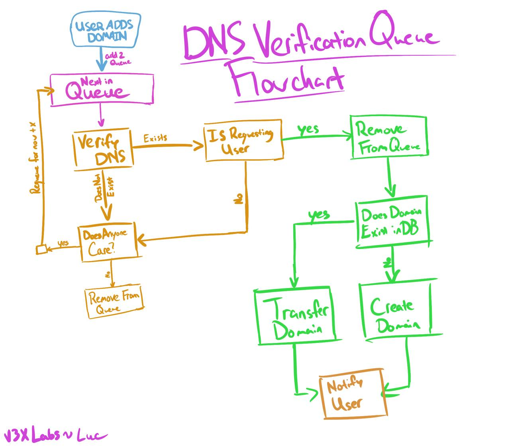

# dns-validate

The purpose of this service is to run work through the queue of domains to validate and will then check the DNS records of each domain

## Flow



|            Key             |                      Purpose                      |
| :------------------------: | :-----------------------------------------------: |
|      `dns:users:luc`       |   is the list of domains luc is trying to claim   |
| `dns:domains:luc.computer` | is the list of users trying to claim luc.computer |
|        `dns:queue`         |         is the ZSET for delayed queueing          |
|        `dns:iqueue`        |        is the LIST for immediate queueing         |

### When a user files a claim

provided the username is `luc`

provided `luc.computer` is the name of the domain.

```
SADD dns:users:luc luc.computer
SADD dns:domains:luc.computer luc
LPUSH dns:iqueue luc.computer
```

### When a user lists their pending domains

provided the username is `luc`

```
SMEMBERS dns:users:luc
```

### When a user removes a domain from its list (and its still unverified)

provided `luc.computer` is the name of the domain.

```
SREM dns:users:luc luc.computer
SREM dns:domains:luc.computer luc
```

// the dns:iqueue and dns:queue might execute one more query and then do their validation and see noone really cares anymore

// technically we could add the domain to a "check if we should deprecate"-queue, but thats beyond overkill

if the output of

```
SMEMBERS dns:domains:luc.computer
```

== 0, we should

```
DEL dns:domains:luc.computer
```

### When a claim succeeds

provided `luc.computer` is the name of the domain.

```
SREM dns:users:luc luc.computer
SMEMBERS dns:domains:luc.computer
```

then loop through the members, and for each member provided their name is `bob`

```
SREM dns:users:bob luc.computer
```

and then finally after finishing the loop

```
DEL dns:domains:luc.computer
```

### When a (delayed/instant) claim fails

provided `Y` is the current timestamp plus delay when to check again (an hour for example).

provided `luc.computer` is the name of the domain.

if

```
EXISTS dns:domains:luc.computer
```

```
ZADD dns:queue Y luc.computer
```

### Every X period of time

provided `Y` is the current timestamp plus delay when to check again (an hour for example).

first check if entries in temp queue, if entries move them to instant queue.

then move the next gap worth of entries to the temp queue
```
ZRANGESTORE dns:tempqueue dns:queue -1 Y BYSCORE
ZREMRANGEBYSCORE dns:queue -1 Y
```

and then foreach chunk of K entries, where the values are `Z`
aka move the entires from temp to instant

```
RPUSH dns:iqueue Z
```
